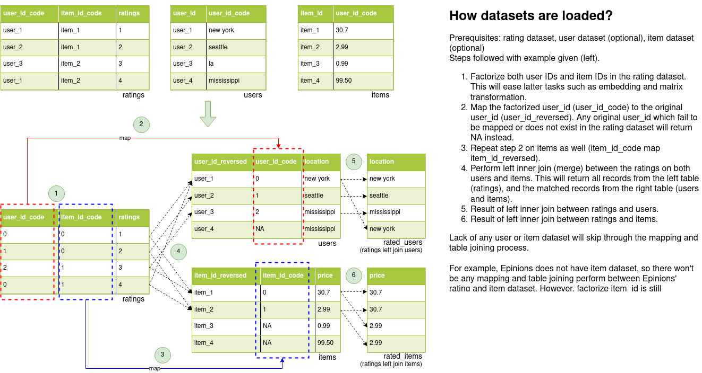

# star-reco

Star classification is a type of ratings scale commonly used by reviewers to rate certain items such as films, TV shows, restaurants, and hotels. These ratings reflect customers' prefences and businesses are able to utilize them to build rating-based recommendation system. 

**star-reco** is a master thesis work + Python module for a series of deep learning rating-based recommendation system. 

**star-reco** is built on top of Pytorch-lightning for reproducing and developing rating-based recommendation algorithms in a unified and simple framework for research purposes. Current supported algorithms are:
- Matrix Factorization using back propagration
- Neural Collaborative Filtering
- Neural Network Matrix Factorization
- AutoRec

## Dataloader (How data is loaded?)

