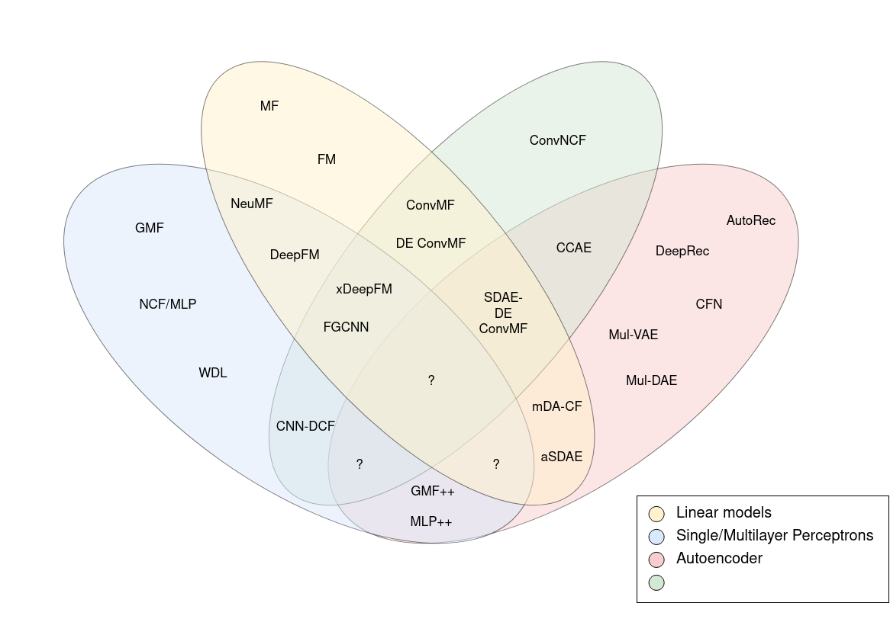

[issues]: https://img.shields.io/github/issues/KyleOng/star-reco
[license]: https://img.shields.io/github/license/KyleOng/star-reco
[version]: https://img.shields.io/badge/python-3.5|3.6|3.7|3.8-blue

# star-reco :star: :robot:
![version] ![issues] ![license]

Pytorch and lightning implementation for a series of deep learning `star` or rating-based `reco`mmendation systems. This work also acts as a part of the master thesis work's literature review. 

**Features:**
+ Up to 25+ recommendation models across 20 publications.
+ GPU acceleration execution.
+ Reducing memory usage for large sparse matrix.
+ Simple and understandable code comments.
+ Code reusability.

Click [here](#start) to get started!

Background
---
Star classification is a type of ratings scale commonly used by reviewers to rate certain items such as films, TV shows, restaurants, and hotels. Businesses are able to utilize user-item star ratings to build rating-based recommendation system, as these ratings can directly or indirectly reflect customers' preferences. This recommendation technique is also known as the **Collaborative Filtering (CF)** technique which recommendations are generated based on user-item interaction analysis. Correspondingly, various techniques for recommendation generation has been proposed throughout the years, in order to solve previous existing problems (For example, cold start and data sparsity). Hence, the purpose of this research is to understand, recreate and evaluate various SOTA recommendation algorithms in a coherent and unified repository.

Research Models
---
<p align="center">
  
  <br>
  <b>Figure 2:</b> Venn diagram of hybrid and non-hybrid recommendation models.
</p>
Current supported research models:
<table>
  <tr>
    <th rowspan = 3>Research models</th>
    <th rowspan = 3>Implementation</th>
    <th colspan = 4>Hybrid models</th>
    <th rowspan = 3>Reference</th>
  </tr>
  <tr>
    <th rowspan = 2>Linear</th>
    <th colspan = 3>Non-linear</th>
  </tr>
  <tr>
    <th>SLP/MLP</th>
    <th>AE</th>
    <th>CNN</th>
  </tr>
  <tr>
    <td>MF</td>
    <td>
      <a href="https://github.com/KyleOng/star-reco/blob/master/starreco/model/mf.py">mf.py</a>
    </td>
    <td>:heavy_check_mark:</td>
    <td></td>
    <td></td>
    <td></td>
    <td><a href="#1">[1]</a></td>
  </tr>
  <tr>
    <td>FM</td>
    <td>
      <a href="https://github.com/KyleOng/star-reco/blob/master/starreco/model/fm.py">fm.py</a>
    </td>
    <td>:heavy_check_mark:</td>
    <td></td>
    <td></td>
    <td></td>
    <td><a href="#2">[2]</a></td>
  </tr>
  <tr>
    <td>GMF</td>
    <td>
      <a href="https://github.com/KyleOng/star-reco/blob/master/starreco/model/gmf.py">gmf.py</a>
    </td>
    <td></td>
    <td>:heavy_check_mark:</td>
    <td></td>
    <td></td>
    <td><a href="#3">[3]</a></td>
  <tr>
    <td>NCF/MLP</td>
    <td>
      <a href="https://github.com/KyleOng/star-reco/blob/master/starreco/model/ncf.py">ncf.py</a>
    </td>
    <td></td>
    <td>:heavy_check_mark:</td>
    <td></td>
    <td></td>
    <td><a href="#3">[3]</a></td>
  </tr>
  <tr>
    <td>WDL</td>
    <td>
      <a href="https://github.com/KyleOng/star-reco/blob/master/starreco/model/wdl.py">wdl.py</a>
    </td>
    <td></td>
    <td>:heavy_check_mark:</td>
    <td></td>
    <td></td>
    <td><a href="#4">[4]</a></td>
  </tr>
  <tr>
    <td>AutoRec</td>
    <td>
      <a href="https://github.com/KyleOng/star-reco/blob/master/starreco/model/ar.py">ar.py</a>
    </td>
    <td></td>
    <td></td>
    <td>:heavy_check_mark:</td>
    <td></td>
    <td><a href="#5">[5]</a></td>
  </tr>
  <tr>
    <td>DeepRec</td>
    <td>
      <a href="https://github.com/KyleOng/star-reco/blob/master/starreco/model/dr.py">dr.py</a>
    </td>
    <td></td>
    <td></td>
    <td>:heavy_check_mark:</td>
    <td></td>
    <td><a href="#6">[6]</a></td>
  </tr>
  <tr>
    <td>CFN</td>
    <td>
      <a href="https://github.com/KyleOng/star-reco/blob/master/starreco/model/cfn.py">cfn.py</a> 
    </td>
    <td></td>
    <td></td>
    <td>:heavy_check_mark:</td>
    <td></td>
    <td><a href="#7">[7]</a></td>
  </tr>
  <tr>
    <td>Mult-VAE</td>
    <td>
      <a href="https://github.com/KyleOng/star-reco/blob/master/starreco/model/mvae.py">mvae.py</a>
    </td>
    <td></td>
    <td></td>
    <td>:heavy_check_mark:</td>
    <td></td>
    <td><a href="#8">[8]</a></td>
  </tr>
  <tr>
    <td>Mult-DAE</td>
    <td>
      <a href="https://github.com/KyleOng/star-reco/blob/master/starreco/model/mdae.py">mdae.py</a>
    </td>
    <td></td>
    <td></td>
    <td>:heavy_check_mark:</td>
    <td></td>
    <td><a href="#8">[8]</a></td>
  </tr>
  <tr>
    <td>ONCF</td>
    <td>
      <a href="https://github.com/KyleOng/star-reco/blob/master/starreco/model/oncf.py">oncf.py</a>
    </td>
    <td></td>
    <td></td>
    <td></td>
    <td>:heavy_check_mark:</td>
    <td><a href="#9">[9]</a></td>
  </tr>
  <tr>
    <td>NeuMF</td>
    <td>
      <a href="https://github.com/KyleOng/star-reco/blob/master/starreco/model/nmf.py">nmf.py</a>
    </td>
    <td>:heavy_check_mark:</td>
    <td>:heavy_check_mark:</td>
    <td></td>
    <td></td>
    <td><a href="#3">[3]</a></td>
  </tr>
  <tr>
    <td>NeuFM</td>
    <td>
      <a href="https://github.com/KyleOng/star-reco/blob/master/starreco/model/nfm.py">nfm.py</a>
    </td>
    <td>:heavy_check_mark:</td>
    <td>:heavy_check_mark:</td>
    <td></td>
    <td></td>
    <td><a href="#10">[10]</a></td>
  </tr>
  <tr>
    <td>DeepFM</td>
    <td>
      <a href="https://github.com/KyleOng/star-reco/blob/master/starreco/model/dfm.py">dfm.py</a>
    </td>
    <td>:heavy_check_mark:</td>
    <td>:heavy_check_mark:</td>
    <td></td>
    <td></td>
    <td><a href="#11">[11]</a></td>
  </tr>
  <tr>
    <td>mDA-CF</td>
    <td>
      <a href="https://github.com/KyleOng/star-reco/blob/master/starreco/model/fgcnn.py">mdacf.py</a>
    </td>
    <td>:heavy_check_mark:</td>
    <td></td>
    <td>:heavy_check_mark:</td>
    <td></td>
    <td><a href="#12">[12]</a></td>
  </tr>
  
  <tr>
    <td>aSDAE+MF</td>
    <td>
      <a href="https://github.com/KyleOng/star-reco/blob/master/starreco/model/asdaemf.py">asadaemf.py</a>
    </td>
    <td>:heavy_check_mark:</td>
    <td></td>
    <td>:heavy_check_mark:</td>
    <td></td>
    <td><a href="#13">[13]</a></td>
  </tr>
  <tr>
    <td>ConvMF</td>
    <td>
      <a href="https://github.com/KyleOng/star-reco/blob/master/starreco/model/cmf.py">cmf.py</a>
    </td>
    <td>:heavy_check_mark:</td>
    <td></td>
    <td></td>
    <td>:heavy_check_mark:</td>
    <td><a href="#14">[14]</a></td>
  </tr>
  <tr>
    <td>DE-ConvMF</td>
    <td>
      <a href="https://github.com/KyleOng/star-reco/blob/master/starreco/model/decmf.py">decmf.py</a>
    </td>
    <td>:heavy_check_mark:</td>
    <td></td>
    <td></td>
    <td>:heavy_check_mark:</td>
    <td><a href="#15">[15]</a></td>
  </tr><tr>
    <td>GMF++</td>
    <td>
      <a href="https://github.com/KyleOng/star-reco/blob/master/starreco/model/cmfpp.py">gmfpp.py</a>
    </td>
    <td></td>
    <td>:heavy_check_mark:</td>
    <td>:heavy_check_mark:</td>
    <td></td>
    <td><a href="#16">[16]</a></td>
  </tr>
  <tr>
    <td>MLP++</td>
    <td> 
      <a href="https://github.com/KyleOng/star-reco/blob/master/starreco/model/mlppp.py">mlppp.py</a>
    </td>
    <td></td>
    <td>:heavy_check_mark:</td>
    <td>:heavy_check_mark:</td>
    <td></td>
    <td><a href="#16">[16]</a></td>
  </tr>
  <tr>
    <td>CNN-DCF</td>
    <td>
      <a href="https://github.com/KyleOng/star-reco/blob/master/starreco/model/cnndcf.py">cnndcf.py</a>
    </td>
    <td></td>
    <td>:heavy_check_mark:</td>
    <td></td>
    <td>:heavy_check_mark:</td>
    <td><a href="#17">[17]</a></td>
  </tr>
  <tr>
    <td>xDeepFM</td>
    <td>
      <a href="https://github.com/KyleOng/star-reco/blob/master/starreco/model/xdfm.py">dfm.py</a>
    </td>
    <td></td>
    <td>:heavy_check_mark:</td>
    <td></td>
    <td>:heavy_check_mark:</td>
    <td><a href="#18">[18]</a></td>
  </tr>
  <tr>
    <td>FGCNN</td>
    <td>
      <a href="https://github.com/KyleOng/star-reco/blob/master/starreco/model/fgcnn.py">fgcnn.py</a>
    </td>
    <td></td>
    <td>:heavy_check_mark:</td>
    <td></td>
    <td>:heavy_check_mark:</td>
    <td><a href="#19">[19]</a></td>
  </tr>
  <tr>
    <td>CCAE</td>
    <td>
      <a href="https://github.com/KyleOng/star-reco/blob/master/starreco/model/ccae.py">ccae.py</a>
    </td>
    <td></td>
    <td></td>
    <td>:heavy_check_mark:</td>
    <td>:heavy_check_mark:</td>
    <td><a href="#20">[20]</a></td>
  </tr>
  <tr>
    <td>SDAE-DE-ConvMF</td>
    <td>
      <a href="https://github.com/KyleOng/star-reco/blob/master/starreco/model/sdaedecmf.py">sdaedecmf.py</a>
    </td>
    <td>:heavy_check_mark:</td>
    <td></td>
    <td>:heavy_check_mark:</td>
    <td>:heavy_check_mark:</td>
    <td><a href="#15">[15]</a></td>
  </tr>
</table>

Datasets
---
- **Movielen Dataset**: A movie rating dataset collected from the Movielens websites by the GroupLensResearch Project  at University of Minnesota. The datasets were collected over various time periods, depending on the sizes given. Movielen 1M Dataset is chosen for evaluation. It contains 1,000,209 anonymous ratings of approximately 3,900 movies made by 6,040 MovieLens users who joined MovieLens in 2000.

- **Epinions Dataset**: A product review dataset collected by Paolo Massa in 5 weeks (November/December 2003) from Epinions.com website.Epinions dataset is used in many recommendation researches works due toits trust factor for better recommendation accuracy. The dataset contains two sources of data which are trust data and rating data. In the trustdataset, all trust values are stored and distrust values are discarded. As for the rating data, each item rating is rated in the scale of 1 to 5. Epinions Dataset also contains 49,290 users who rated a total of 139,738 different items at least once, writing 664,824 reviews and 487,181 issued trust statements.

- **Amazon Dataset**: Amazon dataset is the consumption records from Amazon.com, which contains product reviews and metadata. It includes 142.8 million reviewscollected from May 1996 to July 2004. The Amazon dataset is also categorized into smaller datasets with different categories of productsuch as books, electronics, movie, etc. Hence, researchers can select smaller datasetsbased on their interest of domain of research. The 3 subsets of this Dataset chosen for evaluation are **Amazon Instant Video**, **Amazon Android Apps** and **Amazon Digital Music**.

- **Book Crossing Dataset**.

Getting Started<a name="start"></a>
---
### Installation
| :warning: |This is not meant to be used as a python package. To use this, simply git clone it to get started.|
|-|:-|
 
    git clone https://github.com/KyleOng/star-reco
    pip install -r requirements.txt

### Example
```python
    from pytorch_lightning import Trainer
    from pytorch_lightning.callbacks import ModelCheckpoint
    
    from starreco.data import DataModule
    from starreco.model import MF
    
    # Initialize dataset
    data_module = DataModule("ml-1m")
    data_module.setup()
    
    # Initialize model
    model = MF(([
        data_module.dataset.rating.num_users, 
        data_module.dataset.rating.num_items
    ])
                 
    # Train
    checkpoint_callback = ModelCheckpoint(
        dirpath = "checkpoints/mf",
        monitor = "valid_loss_epoch",
        filename = "mf-{epoch:02d}-{valid_loss_epoch:.4f}"
    )
    trainer = Trainer(
        gpus = 1, 
        max_epochs = 500, 
        progress_bar_refresh_rate = 50, 
        logger = False,
        callbacks=[checkpoint_callback]
    )
    trainer.fit(mf, data_module)
    
    # Evaluate
    model_test = MF.load_from_checkpoint(checkpoint_callback.best_model_path)
    trainer.test(mf_test, datamodule = data_module)
```

Acknowledgements
---
This work is inspired by the following links.
- https://github.com/RUCAIBox/RecBole
- https://github.com/khanhnamle1994/MetaRec
- https://github.com/shenweichen/DeepCTR-Torch

Special thanks to the following repositories for github code references and model/algorithms understanding.
- https://github.com/khanhnamle1994/MetaRec
- https://github.com/makgyver/rectorch
- https://github.com/rixwew/pytorch-fm
- https://github.com/RaptorMai/Deep-AutoEncoder-Recommendation
- https://github.com/shenweichen/DeepCTR/
- https://github.com/cartopy/ConvMF/

References
---
<a id="1">[1]</a> Koren, Y., Bell, R., & Volinsky, C. (2009). Matrix factorization techniques for recommender systems. Computer, 42(8), 30-37. https://www.inf.unibz.it/~ricci/ISR/papers/ieeecomputer.pdf

<a id="2">[2]</a> Rendle, S. (2010, December). Factorization machines. In 2010 IEEE International Conference on Data Mining (pp. 995-1000). IEEE. https://sdcast.ksdaemon.ru/wp-content/uploads/2020/02/Rendle2010FM.pdf

<a id="3">[3]</a> He, X., Liao, L., Zhang, H., Nie, L., Hu, X., & Chua, T. S. (2017, April). Neural collaborative filtering. In Proceedings of the 26th international conference on world wide web (pp. 173-182). https://www.comp.nus.edu.sg/~xiangnan/papers/ncf.pdf

<a id="4">[4]</a> Cheng, H. T., Koc, L., Harmsen, J., Shaked, T., Chandra, T., Aradhye, H., ... & Shah, H. (2016, September). Wide & deep learning for recommender systems. In Proceedings of the 1st workshop on deep learning for recommender systems (pp. 7-10). https://arxiv.org/pdf/1606.07792.pdf%29/

<a id="5">[5]</a> Sedhain, S., Menon, A. K., Sanner, S., & Xie, L. (2015, May). Autorec: Autoencoders meet collaborative filtering. In Proceedings of the 24th international conference on World Wide Web (pp. 111-112). http://users.cecs.anu.edu.au/~u5098633/papers/www15.pdf

<a id="6">[6]</a> Kuchaiev, O., & Ginsburg, B. (2017). Training deep autoencoders for collaborative filtering. arXiv preprint arXiv:1708.01715. https://arxiv.org/pdf/1708.01715.pdf

<a id="7">[7]</a> Strub, F., Mary, J., & Gaudel, R. (2016). Hybrid collaborative filtering with autoencoders. arXiv preprint arXiv:1603.00806. https://arxiv.org/pdf/1603.00806.pdf

<a id="8">[8]</a> Liang, D., Krishnan, R. G., Hoffman, M. D., & Jebara, T. (2018, April). Variational autoencoders for collaborative filtering. In Proceedings of the 2018 world wide web conference (pp. 689-698). https://arxiv.org/pdf/1802.05814.pdf

<a id="9">[9]</a> He, X., Du, X., Wang, X., Tian, F., Tang, J., & Chua, T. S. (2018). Outer product-based neural collaborative filtering. arXiv preprint arXiv:1808.03912. https://arxiv.org/pdf/1808.03912.pdf

<a id="10">[10]</a> He, X., & Chua, T. S. (2017, August). Neural factorization machines for sparse predictive analytics. In Proceedings of the 40th International ACM SIGIR conference on Research and Development in Information Retrieval (pp. 355-364). https://arxiv.org/pdf/1708.05027.pdf

<a id="11">[11]</a> Guo, H., Tang, R., Ye, Y., Li, Z., & He, X. (2017). DeepFM: a factorization-machine based neural network for CTR prediction. arXiv preprint arXiv:1703.04247. https://arxiv.org/pdf/1703.04247.pdf

<a id="12">[12]</a> Li, S., Kawale, J., & Fu, Y. (2015, October). Deep collaborative filtering via marginalized denoising auto-encoder. In Proceedings of the 24th ACM international on conference on information and knowledge management (pp. 811-820). https://arxiv.org/pdf/1904.04447.pdf

<a id="13">[13]</a> Dong, X., Yu, L., Wu, Z., Sun, Y., Yuan, L., & Zhang, F. (2017, February). A hybrid collaborative filtering model with deep structure for recommender systems. In Proceedings of the AAAI Conference on Artificial Intelligence (Vol. 31, No. 1). https://ojs.aaai.org/index.php/AAAI/article/view/10747/10606

<a id="14">[14]</a> Kim, D., Park, C., Oh, J., Lee, S., & Yu, H. (2016, September). Convolutional matrix factorization for document context-aware recommendation. In Proceedings of the 10th ACM conference on recommender systems (pp. 233-240). http://uclab.khu.ac.kr/resources/publication/C_351.pdf

<a id="15">[15]</a> Zhao, J., Liu, Z., Chen, H., Zhang, J., & Wen, Q. (2019, June). Hybrid recommendation algorithms based on ConvMF deep learning model. In 2019 International Conference on Wireless Communication, Network and Multimedia Engineering (WCNME 2019) (pp. 151-154). Atlantis Press. https://download.atlantis-press.com/article/125910161.pdf

<a id="16">[16]</a> Liu, Y., Wang, S., Khan, M. S., & He, J. (2018). A novel deep hybrid recommender system based on auto-encoder with neural collaborative filtering. Big Data Mining and Analytics, 1(3), 211-221. https://ieeexplore.ieee.org/stamp/stamp.jsp?tp=&arnumber=8361573

<a id="17">[17]</a> Wu, Y., Wei, J., Yin, J., Liu, X., & Zhang, J. (2020). Deep Collaborative Filtering Based on Outer Product. IEEE Access, 8, 85567-85574. https://ieeexplore.ieee.org/stamp/stamp.jsp?arnumber=9086604

<a id="18">[18]</a> Lian, J., Zhou, X., Zhang, F., Chen, Z., Xie, X., & Sun, G. (2018, July). xdeepfm: Combining explicit and implicit feature interactions for recommender systems. In Proceedings of the 24th ACM SIGKDD International Conference on Knowledge Discovery & Data Mining (pp. 1754-1763). https://arxiv.org/pdf/1803.05170.pdf

<a id="19">[19]</a> Liu, B., Tang, R., Chen, Y., Yu, J., Guo, H., & Zhang, Y. (2019, May). Feature generation by convolutional neural network for click-through rate prediction. In The World Wide Web Conference (pp. 1119-1129). https://arxiv.org/pdf/1904.04447.pdf

<a id="20">[20]</a> Zhang, S. Z., Li, P. H., & Chen, X. N. (2019, December). Collaborative Convolution AutoEncoder for Recommendation Systems. In Proceedings of the 2019 8th International Conference on Networks, Communication and Computing (pp. 202-207). https://dl.acm.org/doi/abs/10.1145/3375998.3376031
