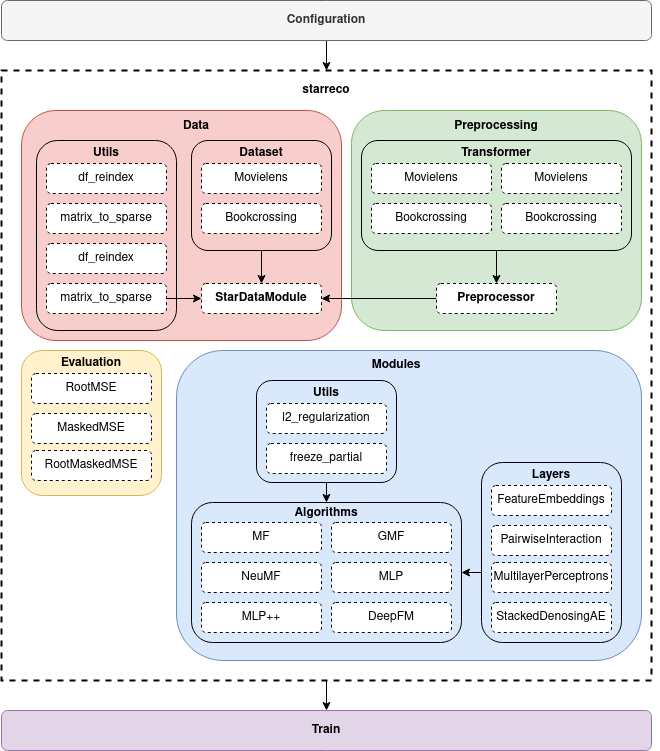

[version]: https://img.shields.io/badge/python-3.6|3.7|3.8-blue?logo=data%3Aimage%2Fpng%3Bbase64%2CiVBORw0KGgoAAAANSUhEUgAAABAAAAAQCAYAAAAf8%2F9hAAAABHNCSVQICAgIfAhkiAAAArxJREFUOI1tU0toVGcU%2Fu7NOI2Tp5No0iQ0BpuHr4jaYKEmbekicSNxUwRLpasiuFGyEhfus5S4EUVBRHRTulGqtgkUFyZB%2B8pLJciEsc5MdPK4c%2B%2F9%2F%2FNwkTsyDh74OJyf7%2F%2B%2Bc37O76AstrTvOt55aPDnms%2F7%2BuKJ%2BoTx1zm%2FtJBNP3lwK7sweZECb7GUX1EuMHR69N7IqR97160bz654jqq6n1TX19S19XzhLb%2FSQi51v5TvlgtUNu1offEqj0x%2BHUwWQhZMFnDcTYmGlj4A8VJ%2BrFzg6d1rvz2962wWZqgwWg8O9gszhAmq6gBwPhCorG3c3fXdidHtXw0PqapDJoQQgSiEkAVZA2ELZoKKgFM%2F%2BBQW9OyF6ctX7qTOuy37vjnVcfjYIFQdIYJwBCIIcVQzVARC1oICVGjonDnZ%2FP2ezkS%2F27r%2F22HAcZkJwhbCBC7NRGAi2LAQbKvMhUoeQB7am6R%2BZ0d8IFbX2t1cdBFmBGtv%2FMzc4znj5ddVZOOcLLVULfPIce0GBSgiWaNtsWAlF8Sr66uELPzVnJ9cvPRw7NzeL%2Fd0f9oIDqDWw0auAyiqyYeSB2ErbvbZ9HzxlbPzU%2FPnT%2B%2Fq29uTbARHThwA5L93BW%2FA%2BL6kM%2Fa5m%2F574kbo5X1mgvFW1g72NjYp%2BVAqQMmD2ghl9fjk2vM%2F%2FzIPY28W%2F7k58%2BtYsrq5YyCfmpmB1PaDfYB8%2FDebW773x9KMigXYAmKgYhAG1v4yEdzOvNXp4lI4xQ3jpZMByI9mjzISgMlj9Ori7%2BfG8sMADAALQIqrrABCAOHqyqrdmDWamwXO1p%2FgJI%2BiUDAUXQ4ByEc%2Fk5DtOtAT76qsCGKgApRWAfMa%2Fz6ZzFy6nb6eeq2PIsP3rX8QNVUVbYd6a490fhb7uqFOG%2FyCMbm35v%2BpWTMx91LGmZEu5b8DYBzjuSeskMYAAAAASUVORK5CYII%3D
[pytorch]: https://img.shields.io/badge/made%20with-Pytorch-critical?logo=data%3Aimage%2Fpng%3Bbase64%2CiVBORw0KGgoAAAANSUhEUgAAACAAAAAgCAMAAABEpIrGAAACMVBMVEUAAAAAAAD%2FAACAAAD%2FAAD%2FgACqVQD%2FVQD%2FVVW%2FQED%2FQEDMMzP%2FZjPVVSv%2FVSvbSSTjVTnmTTP%2FTTPoRi7qVSvrTiffUDDyUSjzSTHpTiz0SivrRynpSSzxTCnrSijsSyzzSyztSSvtTSruSi3uTizvTCvqSivvTi%2FwTS7xTSvsTCvxTCvsSirtTS7tTC3uTivuTSvuSyruSy7vTS3rSyvvSyvsTSvwSy3wTiztSyvtTivuTS3uTC3uSyzuSizuTSzrSyvvTS3sTCztTSvtTCvuSyvuTSvuTizvSyvsTS3vTS3tTC3tTCvuTS3uTCzsSyzvTSzvTCztTS3tSyzuTCvwTCvuTCzuSyzwSyzuTCzuSyvuTS3vTSztTCvvTCzuTCvuSyztTCzvTCzvTSztTCzvTCztTS3uTCzuSyzuTCzuSy3uSyztTCvuSyvuTCzuTCzuTCvtSyztTCzuTCzuTCzuSyzuTC3uTCzvTCzvTCzuTCzuTCzuTSzuTCzuTCzvTCzuTSzuTCzuTCzuTSvuTS3uTCztSyzuTSztTCzvTSzuTCzvTCzvTSzuTCzvTCzuTCzuTSzuTCzuTCzuTCzuTCztTCzuTCzuTCzuTCzvTCzuTCzuTSzvTSzuTCzvTC3uTCzuTCzuTCzvTCzwTSzxTSzxTS3yTS3zTS3zTi30Ti31Ti32Ti32Ty32Ty73Ty74Ty75Ty75UC76UC77UC78UC%2F8US%2F9US%2F%2BUS%2F%2FUi%2F%2FUzD%2FVTGKZSKcAAAAoXRSTlMAAQECAgIDAwMEBAUFBgYHCQoKCwwNEBMVFxgZIyUmKSkqKy0uLzAxMjU2Njc4OTs8PT0%2FQUFCREVHSElKS0xMTk9RU1RYWVxfYGBhZWdobW5vcXN2dnl6hIaIiIyNkZOVm5ucnZ2goqOkpqmrsLO1trq7v8DBwsXNz9DR0tPW2tzd3t%2Ff4ubm6ens7Ozt7u%2Fw8fLz9PX19vf4%2Bfr6%2FPz9%2FkzmhMoAAAILSURBVHjafJIDdyVLGEV3vqRe%2Bjbe2LZt256MmbHNYKyMEdt2I%2Fpzw%2BjyLNdBr95V%2BEmEPkSQKLZuRwvv%2B1hXH4cZ1tdYk9u2Ez1G18L0V2VXOvv4P0xfZ0VOed27MTBo2wwkhL8sq6Lm0wwU59s%2FTyE2yF%2BSWVH9ZRYmKrmjbQN9lF%2FAx6K0iupvc9BFWJkc3xf8NnTmp1ZVfZ%2BHEQUgwMTRqF7%2BqJS6ih8LOn2FYlxKYr%2FuDQV33ZL0xejSVeiX1OaeJrp7YEtDSdnmbh%2BEAxVlebMw6Fx8YDdeQnq%2BGQu3mu0LiABoTMuuzZjqdwcWywrtl8PwAfzHnqbGe%2FjBi6V%2FQkv%2BEnRAhHjXPuGPToTLbsMuNEDgmtewH18AueO2cwgVBQLXvYa9AQGdo7Zz%2BF9AOOM2Hwl4SIqzbsPuv4dRioN2000QP9%2F3qLVgKTqAxqKi2g8j0emRyfQM99Vw9M5fSmxsOIYhPQPCOdu%2B2AkKjTi7NHN2zxNQJmuKqvLnYtAZGPikserFKMTSoiXGZ8G09%2BUtXaQBg4WF5TVvVtKlTR8r7KdD0HqR3VFTWVl0dcVQkBHrb5SWO2%2FHo%2FuR3ZxhV9iFz%2B%2Fffvi62K72kseiB7CffKfUdryW3%2FLstFOD%2FX0QDVZfeZZRUl709fHJSQT6%2FDsZ%2Bms6Di5WysJAj7IzYAJmHng4cSNEARcyhOx%2B%2FwfvAAAAAElFTkSuQmCC
[lightning]: https://img.shields.io/badge/made%20with-Pytorch%20Lightning-blueviolet?logo=data%3Aimage%2Fpng%3Bbase64%2CiVBORw0KGgoAAAANSUhEUgAAACAAAAAgCAMAAABEpIrGAAAAclBMVEUAAABwIN9wMN94KN94KOd4MN94MOd4LON2LeJ4LeR6Luh5LuR5LuZ6Lud4LuN5LuZ4LuN4L%2BV6LeV4LuR5LeR5LeZ5LuV5LuV5LuWBO%2BeJSOiSVembYuurfO6rfO%2B0ifG8lvLNsPXdy%2Fjm2Pru5fz%2F%2F%2F8%2FsQg4AAAAGHRSTlMAEBAgICAgQFBgb3Bwf4CPkJ%2BfoL%2B%2F3%2B93imz1AAAAsklEQVR42pWOVaLDQAzEtszceqdhvP8RH0Mndki%2FksGNZP64zjr05AAAh2mb33h8IRtTrx74Q%2FSdyQlE85WtRwPZv24XGMj61z%2FQwvUnAJE98YcVZCU6g6zOdUC%2BTnRAvg51QL4OOoL4M6gCHahCBVwUHQH6NkTkjSAlbwQFeSMoyevgGcAKljeY3Bful41oLSv3ytGz9kfS6s5l6jRL%2BTu%2Bcgy%2F4neuleUZONN2nSwc8w52pTpHkqDqRQAAAABJRU5ErkJggg%3D%3D

# starreco
![version] ![pytorch] ![lightning] [](./LICENSE)

**starreco** stands for **S**tate-of-**T**he-**A**rt **R**eview **Reco**mmendation System.

**starreco** is a Pytorch and lightning implementation for a series of SOTA deep learning rating-based recommendation systems. This repository also serves as a part of the author's master thesis work's literature review. 

Features
---
+ Up to 25+ recommendation models across 20 publications.
+ Built on top of Pytorch lightning. [Why Pytorch lightning?](https://github.com/PyTorchLightning/pytorch-lightning)
+ GPU acceleration execution.
+ Reducing memory usage for large sparse matrices.
+ Simple and understandable code.
+ Easy extension and code reusability.

Click [here](#start) to get started!

Background
---
Star classification is a type of ratings scale commonly used by reviewers to rate certain items such as films, TV shows, restaurants, and hotels. These ratings can directly reflect customers' interest, and we can use them to build rating-based recommendations. In recent years, RS research has proposed a wide variety of artificial intelligence techniques, ranging from traditional matrix factorization (MF) to complex deep neural networks (DNN). 

Collaborative Filtering (CF) is one of the two recommendation techniques, which are widely employed in rating-based recommendations. However, traditional CF methods such as MF, have limited learning capabilities as they only consider the linear combination between user and item latent vectors. To learn non-linear relationships, methods like Neural Collaborative Filtering (NCF) have incorporated DNN into traditional CF methods. Even so, the core of these methods are still CF and CF methods usually suffer from data sparsity and cold start problems. To tackle these problems, several studies have integrated side information into CF methods, which constructed a hybrid-based RS.

Architecture
---
<p align="center">
  
  <br>
  <b>Figure</b>: starreco overall architecture
</p>

Research Models
---
Current supported research models:
<table>
  <tr>
    <th rowspan = 3>Research model</th>
    <th rowspan = 3>Description</th>
    <th colspan = 4>Hybrid models</th>
    <th rowspan = 3>Reference</th>
  </tr>
  <tr>
    <th rowspan = 2>Linear</th>
    <th colspan = 3>Non-linear</th>
  </tr>
  <tr>
    <th>SLP/MLP</th>
    <th>AE</th>
    <th>CNN</th>
  </tr>
  <tr>
    <td>
      <a href="https://github.com/KyleOng/star-reco/blob/master/starreco/model/mf.py">MF</a>
    </td>
    <td>Matrix Factorization</td>
    <td>:heavy_check_mark:</td>
    <td></td>
    <td></td>
    <td></td>
    <td><a href="#1">[1]</a></td>
  </tr>
  <tr>
    <td>
      <a href="https://github.com/KyleOng/star-reco/blob/master/starreco/model/fm.py">FM</a>
    </td>
    <td>Factorization Machine</td>
    <td>:heavy_check_mark:</td>
    <td></td>
    <td></td>
    <td></td>
    <td><a href="#2">[2]</a></td>
  </tr>
  <tr>
    <td>
      <a href="https://github.com/KyleOng/star-reco/blob/master/starreco/model/gmf.py">GMF</a>
    </td>
    <td>Generalized Matrix Factorization</td>
    <td></td>
    <td>:heavy_check_mark:</td>
    <td></td>
    <td></td>
    <td><a href="#3">[3]</a></td>
  <tr>
    <td>
      <a href="https://github.com/KyleOng/star-reco/blob/master/starreco/model/ncf.py">NCF/MLP</a>
    </td>
    <td>Neural Collaborative Filtering / Multilayer Perceptrons</td>
    <td></td>
    <td>:heavy_check_mark:</td>
    <td></td>
    <td></td>
    <td><a href="#3">[3]</a></td>
  </tr>
  <tr>
    <td>
      <a href="https://github.com/KyleOng/star-reco/blob/master/starreco/model/wdl.py">WDL</a>
    </td>
    <td>Wide and Deep Learning</td>
    <td></td>
    <td>:heavy_check_mark:</td>
    <td></td>
    <td></td>
    <td><a href="#4">[4]</a></td>
  </tr>
  <tr>
    <td>
      <a href="https://github.com/KyleOng/star-reco/blob/master/starreco/model/ar.py">AutoRec</a>
    </td>
    <td>AutoRec</td>
    <td></td>
    <td></td>
    <td>:heavy_check_mark:</td>
    <td></td>
    <td><a href="#5">[5]</a></td>
  </tr>
  <tr>
    <td>
      <a href="https://github.com/KyleOng/star-reco/blob/master/starreco/model/dr.py">DeepRec</a>
    </td>
    <td>DeepRec</td>
    <td></td>
    <td></td>
    <td>:heavy_check_mark:</td>
    <td></td>
    <td><a href="#6">[6]</a></td>
  </tr>
  <tr>
    <td>
      <a href="https://github.com/KyleOng/star-reco/blob/master/starreco/model/cfn.py">CFN</a> 
    </td>
    <td>Collaborative Filtering Neural network</td>
    <td></td>
    <td></td>
    <td>:heavy_check_mark:</td>
    <td></td>
    <td><a href="#7">[7]</a></td>
  </tr>
  <tr>
    <td>
      <a href="https://github.com/KyleOng/star-reco/blob/master/starreco/model/mvae.py">Mult-VAE</a>
    </td>
    <td>Variational Autoencoder for Collaborative filtering with Multinomial prior</td>
    <td></td>
    <td></td>
    <td>:heavy_check_mark:</td>
    <td></td>
    <td><a href="#8">[8]</a></td>
  </tr>
  <tr>
    <td>
      <a href="https://github.com/KyleOng/star-reco/blob/master/starreco/model/mdae.py">Mult-DAE</a>
    </td>
    <td>Denoising Autoencoder for Collaborative filtering with Multinomial prior</td>
    <td></td>
    <td></td>
    <td>:heavy_check_mark:</td>
    <td></td>
    <td><a href="#8">[8]</a></td>
  </tr>
  <tr>
    <td>
      <a href="https://github.com/KyleOng/star-reco/blob/master/starreco/model/oncf.py">ONCF</a>
    </td>
    <td>Outer product-based Neural Collaborative Filtering</td>
    <td></td>
    <td></td>
    <td></td>
    <td>:heavy_check_mark:</td>
    <td><a href="#9">[9]</a></td>
  </tr>
  <tr>
    <td>
      <a href="https://github.com/KyleOng/star-reco/blob/master/starreco/model/nfm.py">NeuFM</a>
    </td>
    <td>Neural Factorization Machine</td>
    <td>:heavy_check_mark:</td>
    <td>:heavy_check_mark:</td>
    <td></td>
    <td></td>
    <td><a href="#10">[10]</a></td>
  </tr>
  <tr>
    <td>
      <a href="https://github.com/KyleOng/star-reco/blob/master/starreco/model/dfm.py">DeepFM</a>
    </td>
    <td>Deep Factorization Machine</td>
    <td>:heavy_check_mark:</td>
    <td>:heavy_check_mark:</td>
    <td></td>
    <td></td>
    <td><a href="#11">[11]</a></td>
  </tr>
  <tr>
    <td>
      <a href="https://github.com/KyleOng/star-reco/blob/master/starreco/model/fgcnn.py">mDA-CF</a>
    </td>
    <td>marginalized Denoising Autoencoder Collaborative Filtering</td>
    <td>:heavy_check_mark:</td>
    <td></td>
    <td>:heavy_check_mark:</td>
    <td></td>
    <td><a href="#12">[12]</a></td>
  </tr>
  
  <tr>
    <td>
      <a href="https://github.com/KyleOng/star-reco/blob/master/starreco/model/asdaemf.py">aSDAE+MF</a>
    </td>
    <td>additional Stacked Denoising Autoencoder + Matrix Factorization</td>
    <td>:heavy_check_mark:</td>
    <td></td>
    <td>:heavy_check_mark:</td>
    <td></td>
    <td><a href="#13">[13]</a></td>
  </tr>
  <tr>
    <td>
      <a href="https://github.com/KyleOng/star-reco/blob/master/starreco/model/cmf.py">ConvMF</a>
    </td>
    <td>Convolutional Matrix Factorization</td>
    <td>:heavy_check_mark:</td>
    <td></td>
    <td></td>
    <td>:heavy_check_mark:</td>
    <td><a href="#14">[14]</a></td>
  </tr>
  <tr>
    <td>
      <a href="https://github.com/KyleOng/star-reco/blob/master/starreco/model/decmf.py">DE-ConvMF</a>
    </td>
    <td>Double Embeddings Convolutional Matrix Factorization</td>
    <td>:heavy_check_mark:</td>
    <td></td>
    <td></td>
    <td>:heavy_check_mark:</td>
    <td><a href="#15">[15]</a></td>
  </tr><tr>
    <td>
      <a href="https://github.com/KyleOng/star-reco/blob/master/starreco/model/gmfpp.py">GMF++</a>
    </td>
    <td>Generalized Matrix Factorization ++</td>
    <td></td>
    <td>:heavy_check_mark:</td>
    <td>:heavy_check_mark:</td>
    <td></td>
    <td><a href="#16">[16]</a></td>
  </tr>
  <tr>
    <td> 
      <a href="https://github.com/KyleOng/star-reco/blob/master/starreco/model/mlppp.py">MLP++</a>
    </td>
    <td>Multilayer Perceptrons ++</td>
    <td></td>
    <td>:heavy_check_mark:</td>
    <td>:heavy_check_mark:</td>
    <td></td>
    <td><a href="#16">[16]</a></td>
  </tr>
  <tr>
    <td>
      <a href="https://github.com/KyleOng/star-reco/blob/master/starreco/model/cnndcf.py">CNN-DCF</a>
    </td>
    <td>Convolutional Neural Networks based Deep Collaborative Filtering model</td>
    <td></td>
    <td>:heavy_check_mark:</td>
    <td></td>
    <td>:heavy_check_mark:</td>
    <td><a href="#17">[17]</a></td>
  </tr>
  <tr>
    <td>
      <a href="https://github.com/KyleOng/star-reco/blob/master/starreco/model/ccae.py">CCAE</a>
    </td>
    <td>Collaborative Convolution AutoEncoder</td>
    <td></td>
    <td></td>
    <td>:heavy_check_mark:</td>
    <td>:heavy_check_mark:</td>
    <td><a href="#18">[18]</a></td>
  </tr>
  <tr>
    <td>
      <a href="https://github.com/KyleOng/star-reco/blob/master/starreco/model/xdfm.py">DeepFM</a>
    </td>
    <td>Extreme Deep Factorization Machine</td>
    <td>:heavy_check_mark:</td>
    <td>:heavy_check_mark:</td>
    <td></td>
    <td>:heavy_check_mark:</td>
    <td><a href="#19">[19]</a></td>
  </tr>
  <tr>
    <td>
      <a href="https://github.com/KyleOng/star-reco/blob/master/starreco/model/fgcnn.py">FGCNN</a>
    </td>
    <td>Feature Generation by Convolutional Neural Network</td>
    <td>:heavy_check_mark:</td>
    <td>:heavy_check_mark:</td>
    <td></td>
    <td>:heavy_check_mark:</td>
    <td><a href="#20">[20]</a></td>
  </tr>
  <tr>
    <td>
      <a href="https://github.com/KyleOng/star-reco/blob/master/starreco/model/sdaedecmf.py">SDAE-DE-ConvMF</a>
    </td>
    <td>Stacked Denoising Autoencoder Double Embeddings Convolutional Matrix Factorization</td>
    <td>:heavy_check_mark:</td>
    <td></td>
    <td>:heavy_check_mark:</td>
    <td>:heavy_check_mark:</td>
    <td><a href="#15">[15]</a></td>
  </tr>
</table>

Datasets
---
- **Movielen Dataset**: A movie rating dataset collected from the Movielens websites by the GroupLensResearch Project  at University of Minnesota. The datasets were collected over various time periods, depending on the sizes given. Movielen 1M Dataset is chosen for evaluation. It contains 1,000,209 anonymous ratings of approximately 3,900 movies made by 6,040 MovieLens users who joined MovieLens in 2000.

- **Epinions Dataset**: A product review dataset collected by Paolo Massa in 5 weeks (November/December 2003) from Epinions.com website.Epinions dataset is used in many recommendation researches works due toits trust factor for better recommendation accuracy. The dataset contains two sources of data which are trust data and rating data. In the trustdataset, all trust values are stored and distrust values are discarded. As for the rating data, each item rating is rated in the scale of 1 to 5. Epinions Dataset also contains 49,290 users who rated a total of 139,738 different items at least once, writing 664,824 reviews and 487,181 issued trust statements.

- **Amazon Dataset**: Amazon dataset is the consumption records from Amazon.com, which contains product reviews and metadata. It includes 142.8 million reviewscollected from May 1996 to July 2004. The Amazon dataset is also categorized into smaller datasets with different categories of productsuch as books, electronics, movie, etc. Hence, researchers can select smaller datasetsbased on their interest of domain of research. The 3 subsets of this Dataset chosen for evaluation are **Amazon Instant Video**, **Amazon Android Apps** and **Amazon Digital Music**.

- **Book Crossing Dataset**.

Getting Started<a name="start"></a>
---
### Installation 
    git clone https://github.com/KyleOng/star-reco
    pip install -r requirements.txt

### Example
```python

from pytorch_lightning import Trainer
from pytorch_lightning.callbacks import ModelCheckpoint
    
from starreco.data import DataModule
from starreco.model import MF
    
# Initialize dataset
data_module = DataModule("ml-1m")
data_module.setup()
    
# Initialize model
model = MF([
    data_module.dataset.rating.num_users, 
    data_module.dataset.rating.num_items
])
                 
# Train
checkpoint_callback = ModelCheckpoint(
    dirpath = "checkpoints/mf",
    monitor = "valid_loss_epoch",
    filename = "mf-{epoch:02d}-{valid_loss_epoch:.4f}"
)
trainer = Trainer(
    gpus = 1, 
    max_epochs = 100, 
    progress_bar_refresh_rate = 50, 
    logger = False,
    callbacks=[checkpoint_callback]
)
trainer.fit(model, data_module)
    
# Evaluate
model_test = MF.load_from_checkpoint(checkpoint_callback.best_model_path)
trainer.test(model_test, datamodule = data_module)
```

Acknowledgements
---
This work is inspired by the following links.
- https://github.com/RUCAIBox/RecBole
- https://github.com/khanhnamle1994/MetaRec
- https://github.com/shenweichen/DeepCTR-Torch

Special thanks to the following repositories for github code references and model/algorithms understanding.
- https://github.com/khanhnamle1994/MetaRec
- https://github.com/makgyver/rectorch
- https://github.com/rixwew/pytorch-fm
- https://github.com/RaptorMai/Deep-AutoEncoder-Recommendation
- https://github.com/shenweichen/DeepCTR/
- https://github.com/cartopy/ConvMF/

References
---
<a id="1">[1]</a> Koren, Y., Bell, R., & Volinsky, C. (2009). Matrix factorization techniques for recommender systems. Computer, 42(8), 30-37. 

<a id="2">[2]</a> Rendle, S. (2010, December). Factorization machines. In 2010 IEEE International Conference on Data Mining (pp. 995-1000). IEEE.

<a id="3">[3]</a> He, X., Liao, L., Zhang, H., Nie, L., Hu, X., & Chua, T. S. (2017, April). Neural collaborative filtering. In Proceedings of the 26th international conference on world wide web (pp. 173-182).

<a id="4">[4]</a> Cheng, H. T., Koc, L., Harmsen, J., Shaked, T., Chandra, T., Aradhye, H., ... & Shah, H. (2016, September). Wide & deep learning for recommender systems. In Proceedings of the 1st workshop on deep learning for recommender systems (pp. 7-10).

<a id="5">[5]</a> Sedhain, S., Menon, A. K., Sanner, S., & Xie, L. (2015, May). Autorec: Autoencoders meet collaborative filtering. In Proceedings of the 24th international conference on World Wide Web (pp. 111-112).

<a id="6">[6]</a> Kuchaiev, O., & Ginsburg, B. (2017). Training deep autoencoders for collaborative filtering. arXiv preprint arXiv:1708.01715.

<a id="7">[7]</a> Strub, F., Mary, J., & Gaudel, R. (2016). Hybrid collaborative filtering with autoencoders. arXiv preprint arXiv:1603.00806.

<a id="8">[8]</a> Liang, D., Krishnan, R. G., Hoffman, M. D., & Jebara, T. (2018, April). Variational autoencoders for collaborative filtering. In Proceedings of the 2018 world wide web conference (pp. 689-698).

<a id="9">[9]</a> He, X., Du, X., Wang, X., Tian, F., Tang, J., & Chua, T. S. (2018). Outer product-based neural collaborative filtering. arXiv preprint arXiv:1808.03912.

<a id="10">[10]</a> He, X., & Chua, T. S. (2017, August). Neural factorization machines for sparse predictive analytics. In Proceedings of the 40th International ACM SIGIR conference on Research and Development in Information Retrieval (pp. 355-364).

<a id="11">[11]</a> Guo, H., Tang, R., Ye, Y., Li, Z., & He, X. (2017). DeepFM: a factorization-machine based neural network for CTR prediction. arXiv preprint arXiv:1703.04247.

<a id="12">[12]</a> Li, S., Kawale, J., & Fu, Y. (2015, October). Deep collaborative filtering via marginalized denoising auto-encoder. In Proceedings of the 24th ACM international on conference on information and knowledge management (pp. 811-820).

<a id="13">[13]</a> Dong, X., Yu, L., Wu, Z., Sun, Y., Yuan, L., & Zhang, F. (2017, February). A hybrid collaborative filtering model with deep structure for recommender systems. In Proceedings of the AAAI Conference on Artificial Intelligence (Vol. 31, No. 1).

<a id="14">[14]</a> Kim, D., Park, C., Oh, J., Lee, S., & Yu, H. (2016, September). Convolutional matrix factorization for document context-aware recommendation. In Proceedings of the 10th ACM conference on recommender systems (pp. 233-240).

<a id="15">[15]</a> Zhao, J., Liu, Z., Chen, H., Zhang, J., & Wen, Q. (2019, June). Hybrid recommendation algorithms based on ConvMF deep learning model. In 2019 International Conference on Wireless Communication, Network and Multimedia Engineering (WCNME 2019) (pp. 151-154). Atlantis Press.

<a id="16">[16]</a> Liu, Y., Wang, S., Khan, M. S., & He, J. (2018). A novel deep hybrid recommender system based on auto-encoder with neural collaborative filtering. Big Data Mining and Analytics, 1(3), 211-221.

<a id="17">[17]</a> Wu, Y., Wei, J., Yin, J., Liu, X., & Zhang, J. (2020). Deep Collaborative Filtering Based on Outer Product. IEEE Access, 8, 85567-85574.

<a id="18">[18]</a> Zhang, S. Z., Li, P. H., & Chen, X. N. (2019, December). Collaborative Convolution AutoEncoder for Recommendation Systems. In Proceedings of the 2019 8th International Conference on Networks, Communication and Computing (pp. 202-207).

<a id="19">[19]</a> Lian, J., Zhou, X., Zhang, F., Chen, Z., Xie, X., & Sun, G. (2018, July). xdeepfm: Combining explicit and implicit feature interactions for recommender systems. In Proceedings of the 24th ACM SIGKDD International Conference on Knowledge Discovery & Data Mining (pp. 1754-1763).

<a id="20">[20]</a> Liu, B., Tang, R., Chen, Y., Yu, J., Guo, H., & Zhang, Y. (2019, May). Feature generation by convolutional neural network for click-through rate prediction. In The World Wide Web Conference (pp. 1119-1129).
